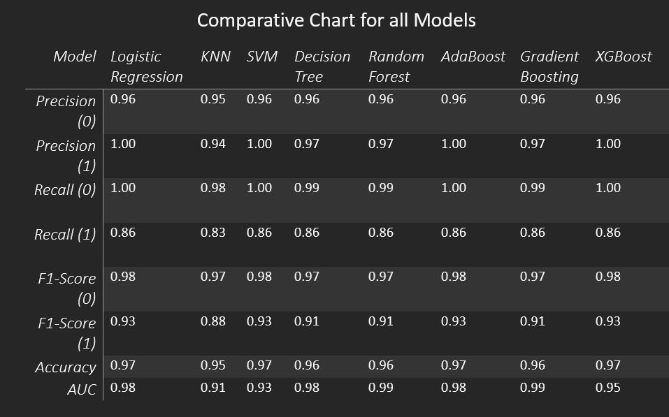

# Breast_Cancer_Research

## Introduction
This research project, conducted by Dorothy Oteng, a graduate student at Howard University in the Applied Data Science and Analytics program, utilizes advanced machine learning techniques to evaluate and predict the outcomes of various treatment approaches for ER+ breast cancer in women. The aim is to address critical gaps in breast cancer research.

Breast cancer is not only the most common cancer among women but also leads to the highest cancer death rates among Black and Hispanic women in the United States, marking it as a significant health concern and a social justice issue.

## Project Objective
This project applies machine learning techniques to investigate breast cancer progression and metastasis in women with ER+ breast cancer. The goal is to evaluate and predict the impact of different treatment approaches on patient outcomes.

## Data Source
The analysis is based on a subset of data from the PLCO trial, a randomized controlled trial that enrolled 155,000 participants to assess the impact of screenings on cancer mortality. Our refined analysis employs machine learning models to explore treatment outcomes.

## Methodology
The project utilizes machine learning models such as Logistic Regression, KNN, SVM, Decision Tree, Random Forest, AdaBoost, Gradient Boosting, and XGBoost. Each model aims to classify the likelihood of cancer recurrence. The Colab notebook meticulously document feature selection, model training, validation, and testing phases.

### Feature Engineering
In this project, we've implemented several feature engineering techniques to optimize our machine learning models for better accuracy and performance in predicting treatment outcomes in ER+ breast cancer. The key steps include:

- **One-Hot Encoding**: We converted categorical variables into a series of binary variables. This transformation is crucial for handling non-numeric data, allowing our models to better interpret the data without introducing ordinal assumptions that come with label encoding.

- **Binary Conversion**: For binary categorical variables, we simplified the data representation by encoding these variables into binary format (0 or 1). This step benefits yes/no features, making it straightforward for models to process.

- **Normalization/Scaling**: We applied normalization techniques to scale the feature data to ensure our machine learning models are not biased towards larger-scale variables. This approach aids in optimizing the algorithm's performance, especially in distance-based models like KNN and SVM.

- **Handling Missing Values**: We addressed missing values strategically to maintain data integrity and avoid skewing our model results. Depending on the nature of the data and its significance, we either imputed missing values using statistical methods or removed data points with missing values where necessary.

- **Feature Selection**: To improve model efficiency and avoid overfitting, we conducted feature selection methods to identify and retain the most informative variables related to breast cancer treatment outcomes. This process not only enhances model performance but also reduces computational complexity.

These feature engineering steps were crucial in developing robust predictive models, as they helped prepare the dataset to be more suitable for the machine learning algorithms employed in this research.

## Findings
The research has uncovered several insights, including:
- Most patients with no metastasis underwent surgery, suggesting an association between surgical intervention and lower metastasis rates.
- Chemotherapy was predominantly associated with no metastasis.
- The ER+ status group had the highest count of patients without metastasis.
The Random Forest model was chosen due to its superior AUC score of 0.99 and Recall, which indicate excellent predictive performance and effectively distinguishing between positive (metastasis) and negative (no metastasis) classes.
- Major findings include a strong association between surgical intervention and lower observed metastasis rates across most models. Additionally, chemotherapy was notably influential in preventing metastasis.
- High precision and recall values for 'no metastasis' predictions across all models suggest reliable screening capabilities, with Random Forest and Gradient Boosting showing solid performance.

Statistical modeling and Chi-Square tests helped identify significant variables and relationships related to metastasis.

### Model Evaluation

The machine learning models in this study were evaluated using a comprehensive set of metrics to ensure robust analysis of their performance in predicting breast cancer metastasis outcomes. The models were evaluated based on Precision, Recall, F1-Score, Accuracy, AUC

## Acknowledgments
Thanks to Howard University, Mastercard Foundation for funding, Dr. Amy Quarkume Yeboah, and Dr. Edmund Ameyaw for guidance. Gratitude is extended to the National Cancer Institute to access the PLCO dataset.

**Author: Dorothy Oteng**.
**CoAuthors: Dr. Amy Quarkume Yeboah & Dr. Edmund Ameyaw**

